# Restaurant Market Analysis

## Table of Contents

- [Project Overview](#project-overview)
- [Data Cleanup Strategy](#data-cleanup-strategy)
- [Visualizations](#visualizations)
- [Key Findings](#key-findings)
- [Temporal Analysis](#temporal-analysis)
- [Implications](#implications)
- [Data Quality](#data-quality)
- [Files](#files)
- [Getting Started](#getting-started)
- [Contributions](#contributions)
- [License](#license)
- [Business Problem](#business-problem)
- [Objectives](#objectives)
- [Dataset](#dataset)
- [Tech Stack](#tech-stack)
- [Project Architecture](#project-architecture)
- [SQL Analysis](#sql-analysis)
- [Statistical Analysis](#statistical-analysis)
- [Market Opportunity Analysis](#market-opportunity-analysis)
- [Dashboard](#dashboard)
- [Limitations](#limitations)
- [Future Improvements](#future-improvements)

An end-to-end, reproducible portfolio project for exploring restaurant coverage, customer ratings, local-currency pricing, cuisines, locations, and digital-service availability.

## Project Overview

The analysis uses the supplied Zomato restaurant snapshot to describe what is present in the dataset. It does not estimate revenue, prove customer demand, predict restaurant success, or infer that service availability causes ratings.

## Business Problem

Restaurant operators and market analysts need a disciplined way to compare coverage, customer feedback, pricing, cuisine mix, location, and digital services. This project provides reusable data preparation, exploratory and statistical analysis, PostgreSQL examples, and an interactive dashboard while making the data's limitations visible.

## Objectives

- Profile and validate the original data without overwriting it.
- Summarize restaurants once at restaurant grain and cuisines at restaurant-cuisine grain.
- Compare ratings, votes, prices, locations, and service flags descriptively.
- Surface review/rating and cuisine-presence patterns for follow-up research.
- Make all transformations and analytical assumptions reproducible.

## Dataset

The raw file is `data/raw/restaurant_data.csv`, copied unchanged from the supplied CSV. The verified source has **9,551 rows and 21 columns**, 15 country codes, 141 city labels, and 12 currency labels. `Restaurant ID` is unique for all 9,551 rows and there are no exact duplicate rows. Nine cuisine values are missing. Coordinates use `(0, 0)` as a placeholder for 497 records. There are 2,148 zero-rated records (`Not rated`), and 18 zero-cost records. All four price bands and all service values are in the expected domains. The switch-to-order-menu flag is `No` for every row, so it has no variation to analyze.

The file has a UTF-8 BOM, handled by the loader. Some source text appears mojibaked (for example, city names and currency labels containing replacement characters); labels are trimmed but not guessed or silently rewritten. The source provides country codes rather than country names, so country reporting and filtering use those codes.

| Source column | Meaning |
|---|---|
| Restaurant ID | Source restaurant identifier; checked for uniqueness |
| Restaurant Name | Restaurant name as provided |
| Country Code | Source numeric country code; not a country name |
| City | Source city/market label |
| Address | Street or venue address |
| Locality | Neighborhood/locality label |
| Locality Verbose | Expanded locality label |
| Longitude, Latitude | Coordinates; `(0, 0)` treated as unknown |
| Cuisines | Comma-separated cuisine labels; may be missing or multi-valued |
| Average Cost for two | Source-reported amount in the associated Currency; not converted |
| Currency | Source currency label; malformed labels are preserved |
| Has Table booking | Yes/No table-booking indicator |
| Has Online delivery | Yes/No online-delivery indicator |
| Is delivering now | Yes/No current-delivery indicator |
| Switch to order menu | Yes/No menu-switch indicator; constant in this snapshot |
| Price range | Ordinal source band 1-4; not a currency amount |
| Aggregate rating | Source rating from 0-5; zero means not rated |
| Rating color | Source rating-color category |
| Rating text | Source rating-text category |
| Votes | Source review-vote count; not sales or revenue |

## Tech Stack

Python, pandas, NumPy, SciPy, Matplotlib, Seaborn, Plotly, Streamlit, PostgreSQL SQL, and unittest/pytest-compatible tests. scikit-learn is listed for extension work; no model is forced onto this descriptive snapshot.

## Project Architecture

```text
data/raw/             Immutable source CSV
data/processed/       Generated restaurant, cuisine, and quality outputs
notebooks/            Five staged analysis notebooks
src/                  Reusable loading, cleaning, features, analysis, plots
sql/                  PostgreSQL schema and six focused query collections
dashboard/            Streamlit interactive application
reports/              Generated findings, tests, opportunities, figures
tests/                Pipeline quality-contract tests
```

## Files

| File or directory | Purpose |
|---|---|
| `data/raw/restaurant_data.csv` | Preserved source dataset |
| `data/processed/` | Generated cleaned restaurant, cuisine, and quality outputs |
| `src/` | Reusable loading, cleaning, feature, analysis, and visualization code |
| `notebooks/` | Five staged exploratory and analytical notebooks |
| `sql/` | PostgreSQL schema and business analysis queries |
| `dashboard/app.py` | Streamlit dashboard application |
| `reports/figures/` | Generated static visualization files |
| `reports/insights.md` | Snapshot findings and interpretation boundaries |
| `tests/` | Data-pipeline and clustering tests |
| `requirements.txt` | Python dependencies |

## Data Cleanup Strategy

Run `python -m src.data_cleaning` from the project root. The pipeline:

- Reads UTF-8 with BOM support and standardizes column labels to snake_case.
- Trims text whitespace and normalizes Yes/No values; unexpected flag values become missing instead of being coerced to a guess.
- Converts numeric fields and validates rating, price-band, vote, and coordinate domains.
- Sets impossible ratings/price bands, negative costs/votes, invalid coordinates, and malformed numeric values to missing rather than inventing replacement values.
- Keeps all restaurant rows and IDs. It does not deduplicate or delete valid extreme values.
- Converts `(0, 0)` coordinates and out-of-range coordinates to missing coordinates, preserving the restaurant record.
- Retains zero ratings as an explicit `Not rated` category, distinct from a low rating.
- Retains zero costs but flags them for interpretation; they may be missing/placeholder values.
- Reports cost outliers with an IQR fence **within each currency**, rather than applying one incomparable threshold across currencies.
- Explodes cuisine labels into a second dataset. Never use exploded row counts as restaurant counts; use distinct restaurant IDs.

Generated artifacts are `data/processed/restaurants_clean.csv`, `restaurant_cuisines.csv`, and `data_quality_report.json`. Processed outputs are reproducible and git-ignored; the original CSV remains preserved.

## Visualizations

Run `python -m src.run_analysis` after cleaning. It writes static plots to `reports/figures/`, correlation and group-test tables to `reports/`, and a cuisine screening table. Price-by-city and price-by-cuisine are grouped by currency, with separate currency panels in visualizations. The relative-cost scatter uses each restaurant's percentile within its currency. These methods prevent false raw-cost comparisons; no exchange rates are present.

Restaurant counts and market totals use the restaurant-level table. Cuisine frequency, rating, and votes use distinct restaurant IDs at cuisine grain. Vote sums across multiple cuisines represent associated votes and may count a restaurant's votes once for each cuisine; they must not be interpreted as unique market-wide votes.

The dashboard's location section also uses scikit-learn DBSCAN with haversine distance, run separately within each country-code/city pair. The documented radius is 500 m and a cluster requires at least five restaurants. Missing coordinates are excluded; noise is not called a cluster. These are clusters of recorded locations only, not footfall or demand hotspots.

### Report Images

The following figures are generated by `python -m src.run_analysis` and are included as portfolio previews.

#### Market Coverage

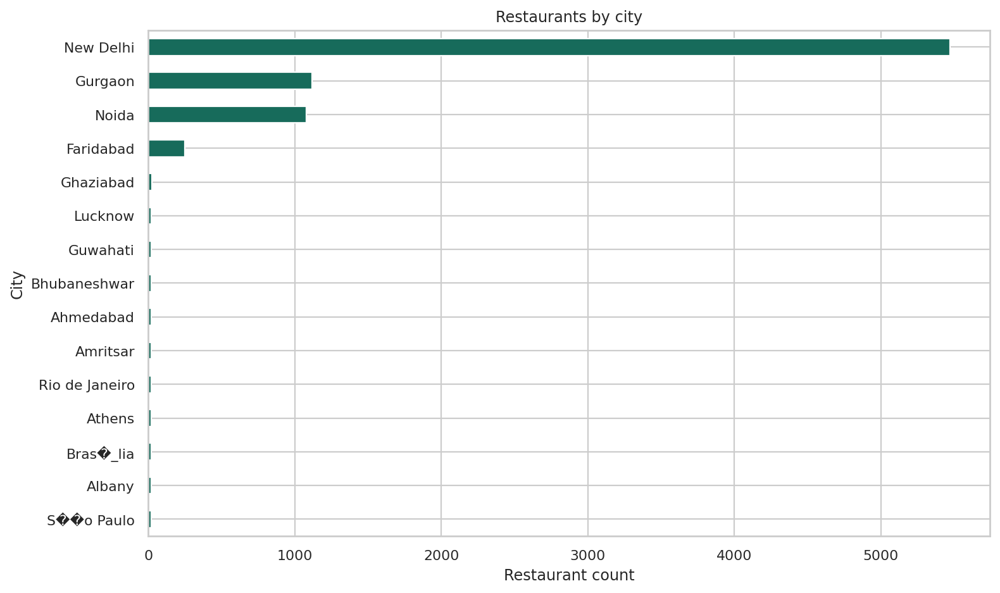

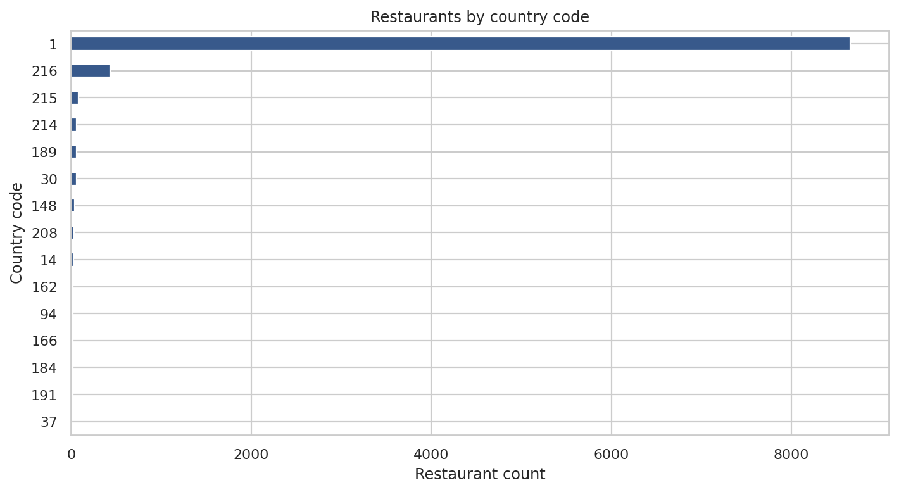

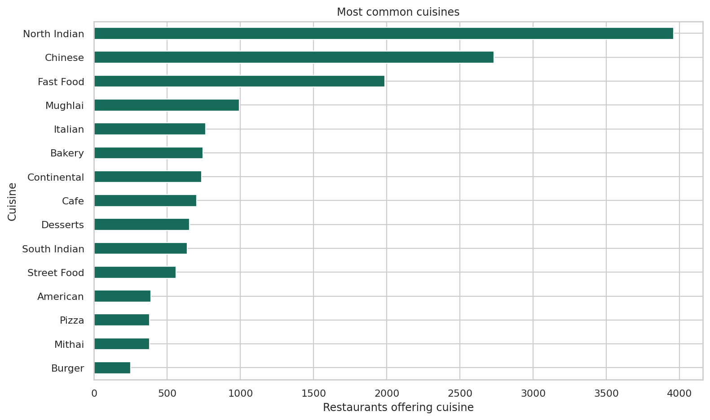

#### Ratings and Pricing

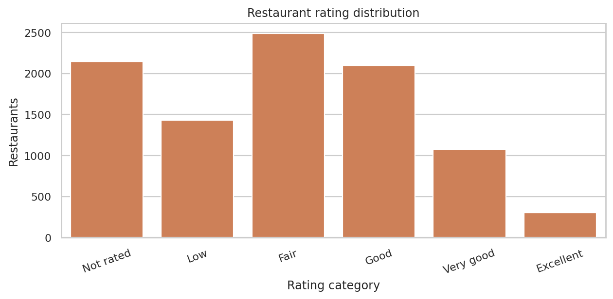

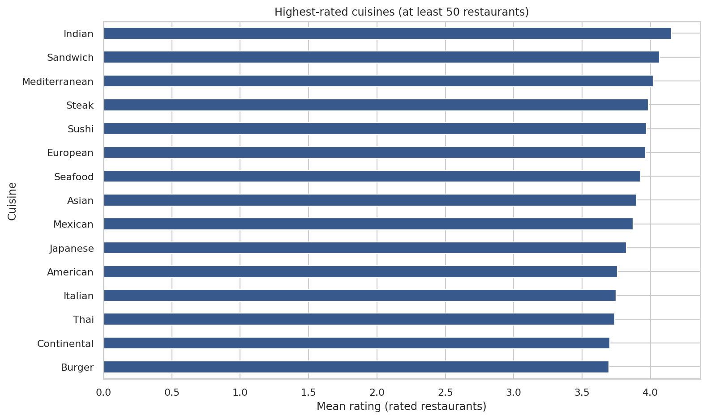

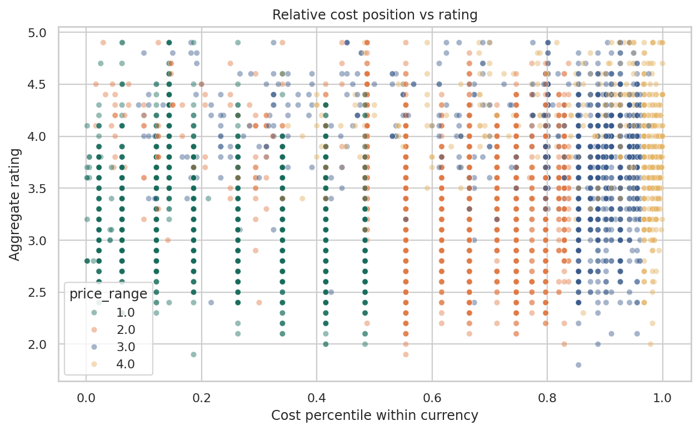

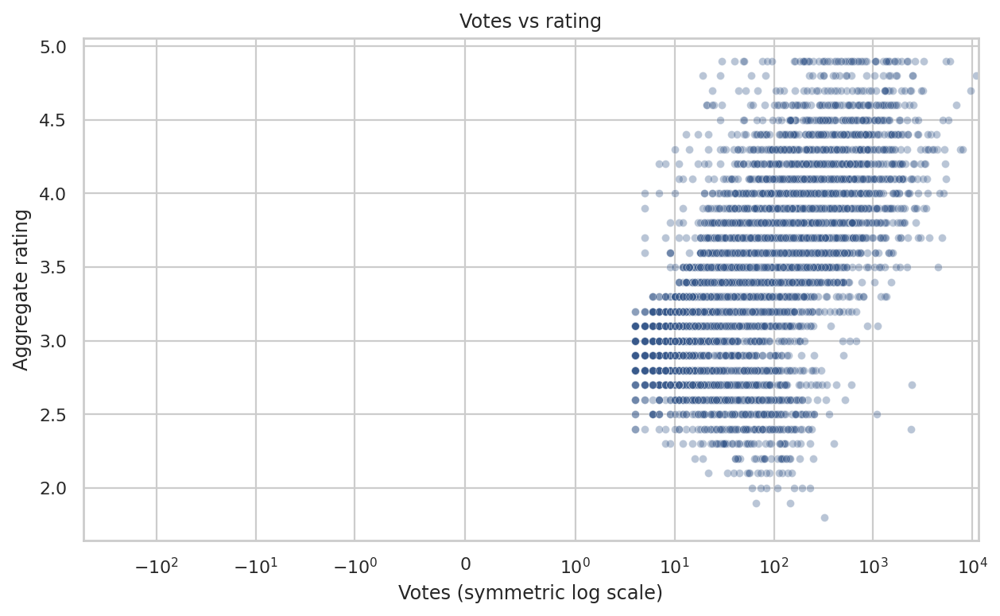

#### Services and Location

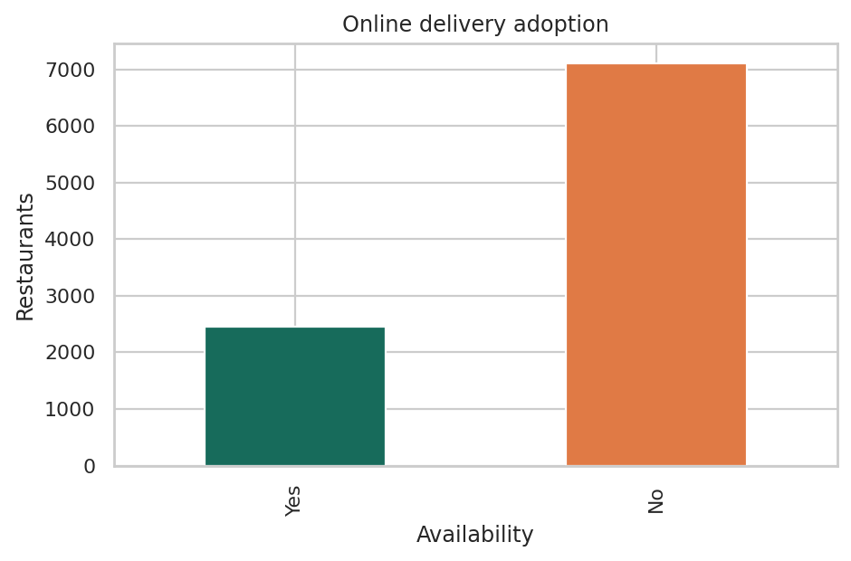

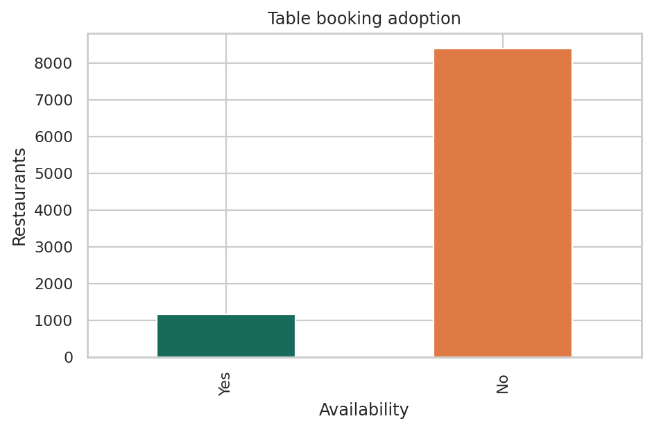

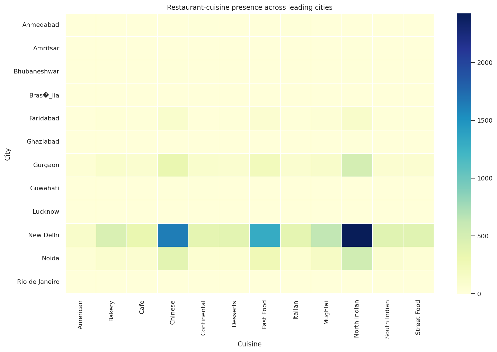

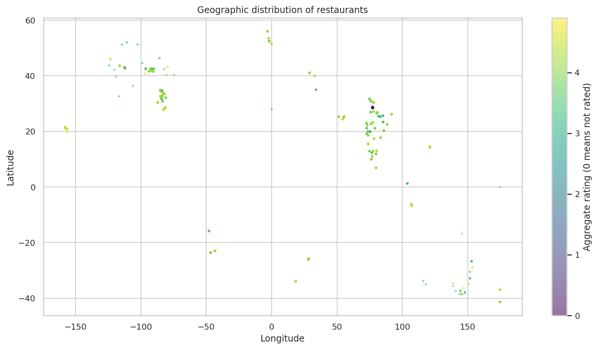

## SQL Analysis

SQL targets PostgreSQL. Run `sql/00_schema.sql`, then load both generated CSVs using `psql` client commands:

```sql
\copy restaurants FROM 'data/processed/restaurants_clean.csv' WITH (FORMAT csv, HEADER true, NULL '')
\copy restaurant_cuisines FROM 'data/processed/restaurant_cuisines.csv' WITH (FORMAT csv, HEADER true, NULL '')
```

The schema and six analysis files cover quality, market overview, customer ratings, pricing, cuisine, and business-opportunity screening. Several queries use PostgreSQL ordered-set aggregates and window functions. See comments in each query file for grain and interpretation cautions.

## Statistical Analysis

Run `python -m src.run_analysis`. The report uses Spearman rank correlations for rating/votes and cost/votes or cost/rating within each currency, Welch's independent-samples t-tests for rated restaurants with/without delivery and booking, and Kruskal-Wallis across price bands. Zero ratings are excluded from rating tests. Results include sample sizes, statistics, and p-values in generated CSVs. Statistical significance is not practical significance; comparisons are observational and may be confounded by country, city, selection, and review behavior. The price-band test concerns ordinal categories, not comparable monetary amounts.

## Temporal Analysis

This dataset is a static snapshot and does not contain dates, opening dates, closing dates, review timestamps, or historical versions. Therefore, the project cannot measure rating trends, restaurant openings, seasonal demand, service adoption over time, or price changes.

The current analysis is intentionally cross-sectional. Temporal analysis should be added when dated snapshots or review and transaction records become available.

## Market Opportunity Analysis

The cuisine screen requires at least five rated restaurants per currency-cuisine segment. Its transparent score is:

`(cuisine mean rating - currency-group mean rating) * (1 - within-currency restaurant-count percentile)`

The score combines a rating gap with relative restaurant presence; the minimum count reduces (but does not eliminate) instability. It is a prioritization heuristic for further research, not a demand estimate or forecast. City counts are coverage, and votes are review activity; neither is population-adjusted demand. Recommendations must be validated with market size, sales, rent, customer research, and operating costs that are absent here.

## Dashboard

Launch using `streamlit run dashboard/app.py`. The dashboard has six sections: market overview, customer and ratings, pricing and cuisine, location, digital services, and market opportunities. Filters include country code, currency, city, cuisine, price range, rating range, table booking, and online delivery. It builds processed outputs automatically on first launch.

## Key Findings

Run the analysis to generate `reports/insights.md` with data-backed summaries for this exact snapshot. Keep findings (what is measured), interpretation (what a pattern may indicate), and recommendations (what to investigate next) distinct. Do not describe votes as customers, spend, or revenue.

## Implications

- The dataset is concentrated in a small number of Indian cities, so conclusions should not be presented as global market estimates.
- Cuisine and rating patterns can prioritize customer-research questions, but they do not prove that a cuisine will succeed in a new location.
- Digital-service comparisons should be repeated within comparable cities, price bands, and markets before operational decisions are made.
- Pricing decisions require currency-specific analysis because reliable exchange rates are not provided.
- High-vote/low-rating restaurants are candidates for service or reputation review; high-rating/low-vote restaurants may merit visibility research.

These are analytical implications, not causal conclusions or investment recommendations.

## Data Quality

The verified source profile found:

- 9,551 rows and 21 columns.
- 9,551 unique restaurant IDs and zero exact duplicate rows.
- 9 missing cuisine values.
- 497 `(0, 0)` coordinate placeholders converted to missing coordinates.
- 2,148 zero ratings labeled `Not rated`.
- 18 zero-cost records retained and flagged for review.
- No invalid ratings or price ranges after validation; service fields use valid Yes/No values.
- 12 currencies, with cost outliers assessed within currency groups.

The complete machine-readable report is generated at `data/processed/data_quality_report.json` after running the cleaning pipeline.

## Getting Started

From the repository root:

```powershell
python -m venv .venv
.venv\Scripts\Activate.ps1
python -m pip install -r requirements.txt
python -m src.data_cleaning
python -m src.run_analysis
python -m unittest discover -s tests -v
streamlit run dashboard/app.py
```

Use `python` from the activated environment. The project uses paths relative to its own files and requires no external APIs. SQL is optional and needs a PostgreSQL server only for database execution.

The dashboard is available at `http://127.0.0.1:8501` after starting Streamlit. It creates processed outputs automatically if they do not yet exist.

## Contributions

Contributions are welcome when they improve reproducibility, analytical correctness, documentation, testing, or dashboard usability. Please:

1. Open an issue describing the proposed change or analytical question.
2. Document transformations, assumptions, and interpretation limits.
3. Add or update focused tests for pipeline changes.
4. Run the cleaning pipeline, analysis generation, and tests before opening a pull request.
5. Avoid committing generated processed data, figures, credentials, or unrelated formatting changes.

## Limitations

- The data is a static observational snapshot with no time field; it cannot establish trends or causality.
- Cost is reported in multiple currencies with no trustworthy exchange-rate table. Costs must not be pooled across currencies.
- Cuisine is missing for nine restaurants, and zero cost may be a placeholder rather than a free meal.
- A zero rating denotes unrated, not a rating of zero. Votes are neither revenue nor a direct measure of demand.
- Geographic coverage is uneven: most records are in a small subset of country codes and Indian cities. The sample is not a representative global census.
- Zero coordinates are missing placeholders; remaining valid coordinates may still be imprecise.
- Ratings and votes are subject to platform coverage, selection, and review bias.
- Country names, population, sales, capacity, operating costs, and historical observations are not supplied.
- Source text contains encoding damage; labels are preserved unless a correction can be verified.

## Future Improvements

- Add dated snapshots to analyze restaurant openings and rating trends.
- Join verified population, sales, rent, and exchange-rate data at matching geographic and time grains.
- Add review-level sentiment analysis if review text becomes available.
- Build restaurant recommendations or demand forecasts only with suitable user, transaction, and temporal data.
- Compare clustering thresholds and validate coordinate precision with a more detailed, authoritative geospatial source.

## License

This project uses the MIT License. The supplied dataset's separate licensing terms should be verified before redistribution.